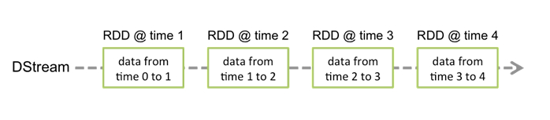
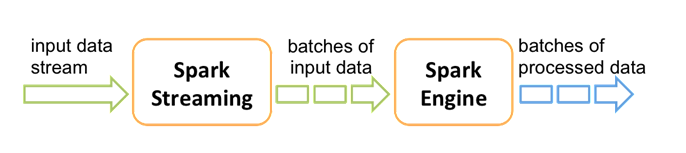
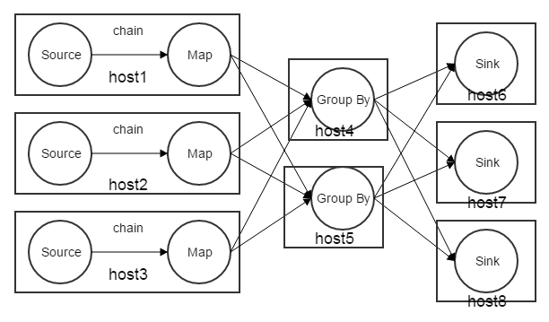

## 简介

Flink与Spark Streaming是现在流行的两大实时计算引擎，都是Apache基金会的顶级项目。

## 编程模型

分布式计算框架一般都是基于DAG（有向无环图）编程，Flink与Spark Streaming也是。Flink和Spark Streaming都将操作定义为算子（Operator），用户通过实现这些算子的接口定义自己的逻辑，并定义这些算子之间的路由关系，就组成了一个DAG图，一个示例如下。

在实时计算中有两个特殊的Operator：Source和Sink。Source负责从数据源拉数据，Sink负责往外部写计算结果。用户实现一些算子定义自己的逻辑，将从Source读到数据的进行处理，并将结果通过Sink写到外部系统，在其他算子中也可以访问外部系统

## 执行调度模型

* **带并行度的DAG图**

从编程模型上看Flink与Spark Streaming都是采用的DAG模型，在运行时都支持Operator上的并行度，加上并行度的DAG图，示例如下。

Flink与Spark都支持Operator上的并行度，所以理论上吞吐是没有上限的，同时它们都使用了将操作符分组的优化，比如图2中的Source和Map形成一个chain，一个chain内的operator会被部署到同一台机器上。在一台机器上的Source会发送到同一台机器上的Map，这样避免了不必要的网络传输，提供了执行效率。

* **Spark Streaming的执行调度模型**

Spark是一个批处理计算引擎，Spark Streaming是Spark的一个上层应用，运用时间段对数据切分，然后将切分后的数据，交给Spark处理。

Spark Streaming负责将从Source读到的一条条的数据按时间段组成小批次，小批次的数据交给Spark 当成批处理计算。

在Job执行期间来说，用的依然是批处理的调度机制, 针对图2中的DAG图解释如下，对一个批次来说，所有的节点都计算source和map，完成了之后再计算Group By，最后再是Sink，由任务调度器不断的给节点分配任务。
所以处理延时可以用如下表示：
**处理延时 = 处理时间 + 调度时间 + 网络传输时间 + Batch周期**。
因为在每个批次，Mater中的调度器要根据任务执行情况，再分配新任务，Master是个单点，在数据量特别大时，容易成为瓶颈，qps在10W以上时特别明显。

* **Flink的执行调度模型**

Flink在Job启动时，调度器会将Operator部署到各个机器上，之后不会再调度任务的部署了，所以任务的执行视图，如下。

Job启动后，Source接收的数据会经过各个Operator的处理最后到Sink输出到外部系统，不存任务的调度。Flink的处理是基于单条记录的，每个Operator处理完一条记录后，就传给下一个Operator。
**处理延时 = 处理时间 + 网络传输时间**

