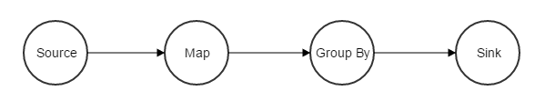
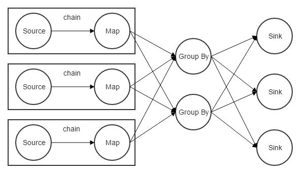

## 简介

Flink与Spark Streaming是现在流行的两大实时计算引擎，都是Apache基金会的顶级项目。

## 编程模型

分布式计算框架一般都是基于DAG（有向无环图）编程，Flink与Spark Streaming也是。Flink和Spark Streaming都将操作定义为算子（Operator），用户通过实现这些算子的接口定义自己的逻辑，并定义这些算子之间的路由关系，就组成了一个DAG图，一个示例如下。

在实时计算中有两个特殊的Operator：Source和Sink。Source负责从数据源拉数据，Sink负责往外部写计算结果。用户实现一些算子定义自己的逻辑，将从Source读到数据的进行处理，并将结果通过Sink写到外部系统，在其他算子中也可以访问外部系统

## 执行调度模型

* **带并行度的DAG图**

从编程模型上看Flink与Spark Streaming都是采用的DAG模型，在运行时都支持Operator上的并行度，加上并行度的DAG图，示例如下。

Flink与Spark都支持Operator上的并行度，所以理论上吞吐是没有上限的，同时它们都使用了将操作符分组的优化，比如图2中的Source和Map形成一个chain，一个chain内的operator会被部署到同一台机器上。在一台机器上的Source会发送到同一台机器上的Map，这样避免了不必要的网络传输，提供了执行效率。
